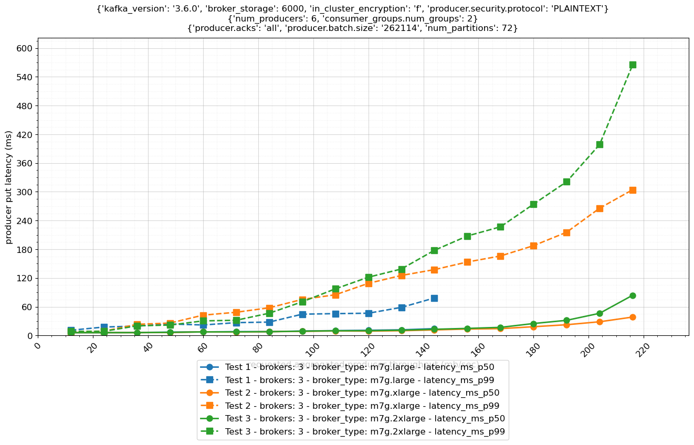

# Apache Kafka Performance Testing Framework

*******
## ⚠️ Important Usage Notice

This code is designed for **testing purposes only** and should never be used in production environments.

### ⚡ Risk Alert
- This code will **DELETE TOPICS** on your Kafka clusters
- Data loss will occur during testing
- Changes are irreversible

### 🔒 Required Environment
Use this code **ONLY** on:
- Dedicated test clusters
- Development environments
- Isolated sandbox environments

### 🚫 Do Not Use On:
- Production clusters
- Live data environments
- Shared development clusters
- Any system containing important data
*******

## Overview

This performance testing framework evaluates the maximum throughput of a Kafka cluster, and compares the put latency of different broker, producer, and consumer configurations. 

To run a test, you need to specify the different parameters that should be tested, and the tool will iterate through all different combinations of the parameters.

The test results can be visualized in a comparative performance graph similar to the graph below.



The performance testing framework is based on the `kafka-producer-perf-test.sh` and `kafka-consumer-perf-test.sh` tools that are part of the Apache Kafka distribution. 

This framework adds AWS-powered automation and visualization around Kafka's native performence testing utilities, leveraging AWS Step Functions for scheduling and orchestration, and AWS Batch for running individual tests.


## Environment Configuration

To deploy the CDK template and run the performance test, you have two options:

### 1. Local Environment Setup

Ensure you have the following tools installed and configured on your local machine: 
- docker >= 24.0.0
- node >= 18.0.0
- typescript >= 5.0.0
- cdk >= 2.171.1
- npm >= 10.9.1
- git >= 2.40.1

### 2. Remote Environment Setup

If you prefer not to configure your local environment, you can use an Amazon EC2 instance. The [create environment](docs/create-env.md) section contains detailed instructions on how to install the dependencies required to successfully deploy the CDK template.

## Download the project files from GitHub

You have to clone the remote repository to create a local copy on your development environment

```bash
# Clone the remote repository
git clone https://github.com/aws-samples/sample-apache-kafka-performance-testing-framework.git 

# Navigate to project directory
cd sample-apache-kafka-performance-testing-framework

# Verify repository contents
ls -la
```

## Configure CDK

Once your environment is configured, you need to edit the `defaults` variable in `cdk/bin/cdk.ts` so that it matches your AWS account details:

```bash
# Navigate to 'cdk/bin'
cd cdk/bin

# Edit the `cdk.ts` using the nano text editor
nano cdk.ts
```
Update the AWS account ID and target AWS Region

```node
const defaults : { 'env': Environment } = {
  env: {
      account: '123456789012',  // Replace with your AWS account ID
      region: 'us-east-1'       // Replace with your target region
  }
};
```
Finally, you need to install all dependencies of the CDK template by running the following command in the `cdk` folder.

```bash
# Navigate back to the 'cdk' folder
cd ..

# Install CDK template dependencies
npm install

# Bootstrap CDK envitonment, if you have never executed CDK in this AWS account and region.
cdk bootstrap
```

## Deploy CDK Stacks

You can now start deploying the CDK stacks to create the resouces in your AWS account.

```bash
# List the available stacks
cdk ls
```

You can observe 9 CDK stacks: <br>
MSK-Perf-Test-VPC <br>
MSK-Perf-Test-M7g-Large <br>
MSK-Perf-Test-M7g-XLarge <br>
MSK-Perf-Test-M7g-2XLarge <br>
MSK-Perf-Test-M7g-2XLarge-PST (Provisioned Storage Throughput enabled at 312 MB/s) <br>
MSK-Perf-Test-M7g-4XLarge <br>
MSK-Perf-Test-M7g-4XLarge-PST (Provisioned Storage Throughput enabled at 625 MB/s) <br>
MSK-Perf-Test-M7g-8XLarge <br>
MSK-Perf-Test-M7g-8XLarge-PST (Provisioned Storage Throughput enabled at 1000 MB/s)

### 1. VPC Stack

The VPC stack will create a new VPC in your AWS account with a 10.0.0.0/16 CIDR, 3 public subnets, 3 private subnets, 3 NAT Gateways and 1 Internet Gateway.

The VPC stack will be deployed by the MSK stasks as a dependency, and it's not required to deploy it independently. However, in case you'd like to deploy the VPC stack individually, you can run the below command:

```bash
# Deploy the CDK VPC stack
cdk deploy MSK-Perf-Test-VPC
```

### 2. MSK Stacks - Choose your MSK Cluster Configuration

The CDK template can either create a new MSK cluster for the performance tests, or you can specify an existing MSK cluster. 
The framework is creating and deleting topics on the MSK cluster to run the performance tests, so it's highly recommended to use a dedicated cluster to avoid any data loss.

#### Create a new MSK cluster and customize the MSK cluster configuration

The default configuration of the CDK template includes three MSK provisioned clusters leveraging standard brokers backed by AWS Graviton processors. You can customize the CDK stack name, the count of brokers, the instance type, instance size, the Apache Kafka version, and more, by editing the `cdk/bin/cdk.ts` file.

```node
new CdkStack(app, 'MSK-Perf-Test-M7g-Large', {
  ...defaults,
  vpc: vpc,
  clusterProps: {
    numberOfBrokerNodes: 1,
    instanceType: InstanceType.of(InstanceClass.M7G, InstanceSize.LARGE),
    ebsStorageInfo: {
      volumeSize: 6000
    },
    encryptionInTransit: {
      enableInCluster: false,
      clientBroker: ClientBrokerEncryption.PLAINTEXT
    },
    kafkaVersion: KafkaVersion.V3_6_0,
  },
});
```

#### Alternatively, you can specify an existing MSK cluster instead of creating a new one:

```node
new CdkStack(app, 'stack-prefix--', {
  ...defaults,
  vpc: vpc,
  clusterName: '...',
  bootstrapBrokerString: '...',
  sg: '...',
});
```

You can then deploy the MSK CDK templates to create the performance test resources into your account.

```bash
# List the available stacks
cdk ls

# Deploy a specific stack
cdk deploy MSK-Perf-Test-M7g-Large
```

⚠️ **Important Cost Information**:
- Resources created by the CDK stacks will incur AWS charges immediately upon creation
- Costs continue to accumulate even when no tests are running

### Solution Architecture Overview


## Performance Test Configuration Guide

After the infrastructure is deployed, you can start the performance tests using an AWS Step Functions workflow that was created during deployment. The workflow uses a simplified test specification that controls how each individual test will run and what parameters will be used.

### Initial Setup With Basic Configuration

In the Step Functions console, navigate to State machines, and select `{CDK-stack-name}-State-Machine-main`. Start the execution by providing the following input:

```json
{
  "test_specification": {
    "parameters": {
      "cluster_throughput_mb_per_sec": [ 12, 24, 36, 48, 60, 72, 84, 96, 108, 120, 132, 144, 156, 168 ],
      "consumer_groups" : [ { "num_groups": 0, "size": 0 }, { "num_groups": 1, "size": 6 }, { "num_groups": 2, "size": 6 } ],
      "num_producers": [ 6 ],
      "client_props": [
        {
          "producer": "acks=all linger.ms=5 batch.size=262114 buffer.memory=2147483648 security.protocol=PLAINTEXT",
          "consumer": "security.protocol=PLAINTEXT"
        }
      ],
      "num_partitions": [ 72 ],
      "record_size_byte": [ 1024 ],
      "replication_factor": [ 3 ],
      "duration_sec": [ 3600 ]
    }
  }
}
```

#### Test Framework Specification

Using the test specification above, the workflow will execute 42 performance tests to measure put latency under varying throughput conditions. 

The test configuration is using the following parameters:
- Producers:	6
- Partitions:	72
- Record Size:	1024 bytes
- Replication Factor: 3
- Duration:	3600 seconds (1 hour)
- Throughput: 12 → 168 MB/sec
- Consumer Groups:
  - 0 groups (no consumers)
  - 1 group (6 consumers)
  - 2 groups (6 consumers each)

#### Test Execution Flow

Phase 1: No consumer groups
- Throughput: 16 → 168 MB/sec
- Measure put latency

Phase 2: One consumer group
- Throughput: 16 → 168 MB/sec
- 6 consumers active
- Measure put latency

Phase 3: Two consumer groups
- Throughput: 16 → 168 MB/sec
- 12 consumers total (6 per group)
- Measure put latency

#### Extensibility

The framework supports additional test parameters through list configuration. Any parameter defined as a list will be automatically included in the test iterations.

### Advanced Configuration Options

#### Throughput Stop Conditions

Since you may not know a cluster's maximum throughput, you can specify a stop condition. This condition tells the test framework when to reset the cluster throughput to the lowest value and select the next test option (or stop if there are no more options).

To automatically stop increasing throughput when the cluster becomes saturated, start the `{CDK-stack-name}-State-Machine-main` execution by providing the following input:

```json
{
  "test_specification": {
    "parameters": {
      "cluster_throughput_mb_per_sec": [ 12, 24, 36, 48, 60, 72, 84, 96, 108, 120, 132, 144, 156, 168 ],
      "consumer_groups" : [ { "num_groups": 0, "size": 0 }, { "num_groups": 1, "size": 6 }, { "num_groups": 2, "size": 6 } ],
      "num_producers": [ 6 ],
      "client_props": [
        {
          "producer": "acks=all linger.ms=5 batch.size=262114 buffer.memory=2147483648 security.protocol=PLAINTEXT",
          "consumer": "security.protocol=PLAINTEXT"
        }
      ],
      "num_partitions": [ 72 ],
      "record_size_byte": [ 1024 ],
      "replication_factor": [ 3 ],
      "duration_sec": [ 3600 ]
    },
    "skip_remaining_throughput": {
      "less-than": [ "sent_div_requested_mb_per_sec", 0.995 ]
    }
  }
}
```

The framework will skip remaining throughput values if the actual throughput sent to the cluster by producers falls below 99.5% of the specified value.

The testing process follows this pattern:
- The first test uses 0 consumer groups and sends 12 MB/s into the cluster.
- The next test maintains 0 consumer groups but increases throughput to 24 MB/s.
- This pattern continues, incrementing throughput, until the cluster becomes saturated.

For example, if the cluster can only absorb 154 MB/s instead of the specified 156 MB/s, the skip condition is met (as the difference exceeds 0.5%).

When this occurs:
- The framework stops increasing throughput for the current consumer group setting.
- It resets the throughput to 12 MB/s.
- It increments to the next consumer group setting (in this case, from 0 to 1).

### Credit Depletion Settings

Amazon EC2 networking, Amazon EBS, and Amazon EBS networking all leverage a credit system that allows the performance to burst over a given baseline for a certain amount of time. This means that the cluster is able to ingest much more throughput for a certain amount of time.

To obtain stable results for the baseline performance of a cluster, the test framework can deplete credits before a test is carried out. To this end it generates traffic that exceeds the peak performance of a cluster and waits until the throughput drops below configurable thresholds.

```json
{
  "test_specification": {
    "parameters": {
      "cluster_throughput_mb_per_sec": [ 12, 24, 36, 48, 60, 72, 84, 96, 108, 120, 132, 144, 156, 168 ],
      "consumer_groups" : [ { "num_groups": 0, "size": 0 }, { "num_groups": 1, "size": 6 }, { "num_groups": 2, "size": 6 } ],
      "num_producers": [ 6 ],
      "client_props": [
        {
          "producer": "acks=all linger.ms=5 batch.size=262114 buffer.memory=2147483648 security.protocol=PLAINTEXT",
          "consumer": "security.protocol=PLAINTEXT"
        }
      ],
      "num_partitions": [ 72 ],
      "record_size_byte": [ 1024 ],
      "replication_factor": [ 3 ],
      "duration_sec": [ 3600 ]
    },
    "skip_remaining_throughput": {
      "less-than": [ "sent_div_requested_mb_per_sec", 0.995 ]
    },
    "depletion_configuration": {
      "upper_threshold": {
        "mb_per_sec": 185
      },
      "lower_threshold": {
        "mb_per_sec": 150
      },
      "approximate_timeout_hours": 1
    }
  }
}
```

With this configuration, the framework will generate a high load to consume burst credits. 

Then, it monitors the throughput to detect when credits are depleted by observing two conditions in sequence:
1. First, the cluster throughput must exceed the `upper_threshold`, indicating the cluster is operating at burst performance levels
2. Then, the throughput must drop below the `lower_threshold`, indicating burst credits have been depleted

Only after both conditions are met (exceeding upper threshold, then falling below lower threshold) will the actual performance test begin. This ensures the test measures baseline performance without the influence of burst credits.

The `approximate_timeout_hours` value of 1 hour sets the maximum duration for the credit depletion phase.

#### How to Choose Your Values
1. `upper_threshold`:
    - Set to approximately 70-80% of your cluster's maximum burst throughput
    - Should be achievable during burst credit usage
    - Example: If your cluster can burst to 250 MB/sec, set to ~185 MB/sec

2. `lower_threshold`
    - Set to approximately 80% of your upper threshold
    - Should be above your expected baseline performance
    - Example: If upper threshold is 185 MB/sec, set to ~150 MB/sec

3. For clusters with different broker counts:
    - Scale thresholds linearly with broker count
    - Example: For 6 brokers, multiply the 3-broker values by 2

## Visualize Performance Test Results

You can visualize the performance test results through Jupyter notebooks once the AWS Step Functions workflow is running. You can find the URL for the SageMaker Notebook in the Outputs section of the CloudFormation stack.

> **Note**
> Initial test execution is required before any output becomes visible. With credit depletion enabled, this process may take up to several hours to complete.

### Installing Dependencies in Jupyter Notebook

To install the dependencies, you have to run the [`01-install-dependencies.ipynb`](notebooks/01-install-dependencies.ipynb) Jupyter notebook.

### Create Visualizations

To create a visualization for the performance test results:
1. Open the [`02-create-visualization-template.ipynb`](notebooks/02-create-visualization-template.ipynb) Jupyter notebook.
2. Add the execution ARN of your Step Functions workflow to the second cell

  ```python
  test_params = []
  test_params.extend([
      {'execution_arn': 'your-execution-arn-here'}  # Replace with your actual ARN
  ])
  ```
3. Execute all cells in the notebook sequentially.

### Advanced Visualization Configuration

The Jupyter notebook processes test results in three steps:
- **Data Collection**: Retrieves performance metrics from CloudWatch Logs using one or more Step Functions state machines execution ARNs
- **Data Processing**: Groups and aggregates results based on test parameters
- **Visualization**:  Generates comparative plots using a user-defined `partitions` variable

The `partitions` variable controls how test results are grouped and displayed. Here's a basic configuration example:

```python
partitions = {
    'ignore_keys': [ 'topic_id', 'cluster_name', 'test_id', 'client_props.consumer', 'cluster_id', 'duration_sec', 'provisioned_throughput',  'throughput_series_id', 'brokers_type_numeric', ],
    'title_keys': [ 'kafka_version', 'broker_storage', 'in_cluster_encryption', 'producer.security.protocol', ],
    'row_keys': [ 'num_producers', 'consumer_groups.num_groups',  ],
    'column_keys': [ 'producer.acks', 'producer.batch.size', 'num_partitions', ],
    'metric_color_keys': [ 'brokers_type_numeric', 'brokers', ],
}
```

To customize this configuration, assign test parameters to different visualization roles:

Configuration Keys:
- `ignore_keys`: Parameters to exclude from visualization
- `title_keys`: Parameters shown in the first row of the plot title (cluster configuration)
- `column_keys`: Parameters shown in the second row of the plot title (test conditions)
- `row_keys`: Parameters to display in the third row of the plot title (test variations)
- `metric_color_keys`: Parameters shown as different colored lines in the plot together with the metric choosen (comparison criteria)

Available Parameters
- `cluster_name`: Cluster name used in the test
- `broker_type`: Broker instance type (e.g., kafka.m7g.large)
- `kafka_version`: MSK cluster Kafka version (e.g. 3.6.0)
- `broker_storage`: Provisioned broker storage in GB
- `in_cluster_encryption`: MSK in-cluster encryption status (true/false)
- `num_partitions`: Partition count
- `producer.security.protocol`: Client-broker protocol type (e.g. SSL)
- `producer.acks`: Producer acks configuration (e.g.: all)
- `producer.batch.size`: Producer batch size
- `num_producers`: Producer count
- `num_brokers`: Broker count
- `broker_storage.pt`: Storage provisioned throughput in MB/s

#### Example Configurations:
1. For comparing tests with different Consumer Groups and same MSK Cluster size and instance types

```python
partitions = {
    'ignore_keys': ['topic_id', 'cluster_id', 'test_id', 'cluster_name'],
    'title_keys': ['kafka_version','broker_storage','broker_type'],
    'row_keys': ['producer.acks','producer.batch.size','num_partitions'],
    'column_keys': ['num_producers','in_cluster_encryption','producer.security.protocol'],
    'metric_color_keys': ['consumer_groups.num_groups']
}
```

2. For comparing tests with different in-cluster encryption and client-broker protocols while keeping same MSK Cluster size and instance types

```python
partitions = {
    'ignore_keys': ['topic_id', 'cluster_id', 'test_id', 'cluster_name'],
    'title_keys': ['kafka_version','broker_storage','broker_type'],
    'row_keys': ['producer.acks','producer.batch.size','num_partitions'],
    'column_keys': ['num_producers','consumer_groups.num_groups'],
    'metric_color_keys': ['in_cluster_encryption','producer.security.protocol']
}
```

## Environment Clean Up 

To remove all CDK deployed resources for the performance test and avoid unnecessary AWS charges, follow these steps:

1. Run the destroy command:
   ```bash
   cdk destroy {stack-name}
   ```

2. Important Notes:
    - CloudWatch log streams containing experiment outputs will be retained. These logs are preserved for future analysis and visualization
    - To completely eliminate all costs, manually delete the following:
      - CloudWatch Log Groups
      - Any remaining CloudWatch Log Streams
      - Any manually created resources not managed by CDK

3. Verify Cleanup:
    - Check your AWS Console to ensure all resources are properly removed
    - Pay special attention to regions where you deployed resources

## Security

See [CONTRIBUTING](CONTRIBUTING.md#security-issue-notifications) for more information.

## License

This library is licensed under the MIT-0 License. See the LICENSE file.